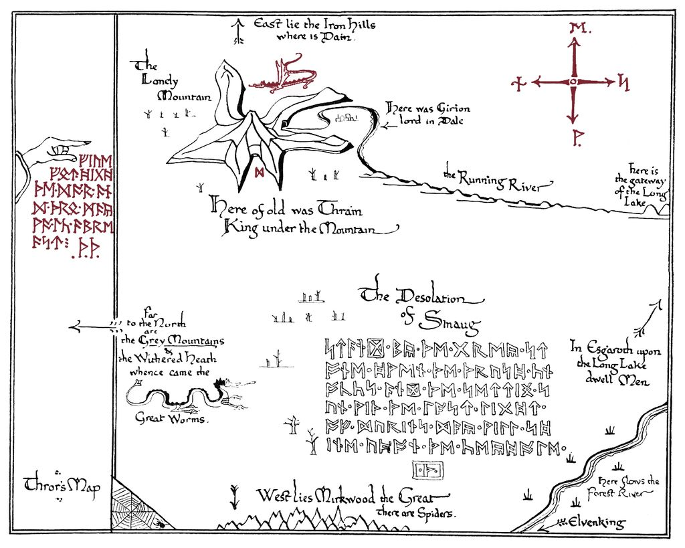
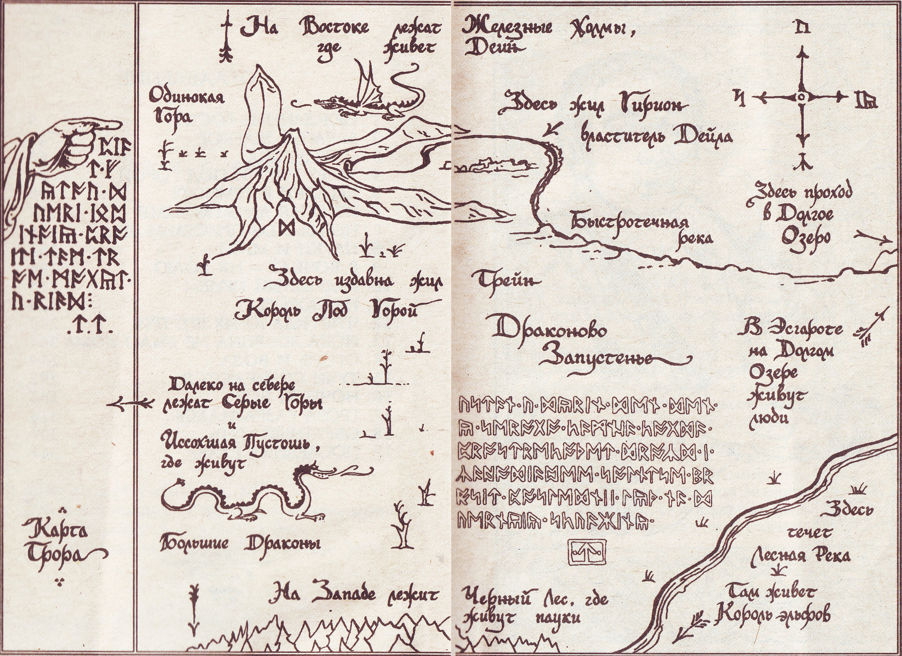

title=How to add custom keyboard layout on Linux
uuid=3437c515-a7ec-4314-b14a-d0324e3065dd
intro=I accidentally ᚦᛖ᛫ᚱᚢᚾᛖᛋ
tags=Linux
style=
styles=footnotes img
scripts=live
created=2023-05-12
PROCESSOR=cmark-gfm --unsafe -e footnotes -e table -e strikethrough -e tasklist --strikethrough-double-tilde

Recently on Fediverse I stumbled upon someone with _runic_ username.
Quick check - and, turns out, runes are part of Unicode [since 1999][runes-wiki]!
Also, Wikipedia has a [whole article][hru-wiki] dedicated to runes in J.R.R. Tolkien's works,
including a subsection about runes from "The Hobbit" -
the ones that I learned by heart back in childhood[^1].

[runes-wiki]: https://en.wikipedia.org/wiki/Runic_(Unicode_block)
[hru-wiki]: https://en.wikipedia.org/wiki/Cirth#Runes_from_The_Hobbit
[^1]: Moreover, in 2007 three more runes were added to Unicode: "k" ᛱ, "sh" ᛲ, and "oo" ᛳ -
not existing historically, but used by J.R.R. Tolkien.

Could I add them as a custom keyboard layout to my Linux machine?

Somewhere on Internet I've heard that it's quite easy!

Just have a look at the file `/usr/share/X11/xkb/symbols/latin` -
it has lines like this:

	key <AD01>  { [         q,          Q,           at,  Greek_OMEGA ] };

They, basically, mean that pressing key `<AD01>` should produce lowercase `q` character,
or uppercase `Q` character when pressed together with Shift key,
or `@` symbol when pressed together with right Alt key,
or Greek Omega character `Ω` when pressed together with both Shift and Alt keys[^2].
Note that you can use _any_ Unicode character there,
just by typing `U1234`.

[^2]: Note that for this to work,
your actually keyboard layout must also include this line:
`include "level3(ralt_switch)"`.

Also note that [on recent systems][custom-blog],
for your custom keyboard layout to be picked up by GUI tools,
it's enough just to save it to the `/usr/share/X11/xkb/symbols/custom` file.

[custom-blog]: http://who-t.blogspot.com/2021/02/a-pre-supplied-custom-keyboard-layout.html

Result
------

And here is my layout:

	default partial alphanumeric_keys
	xkb_symbols "hobbitrunes" {

	    name[Group1]="Hobbit runes";
	    include "level3(ralt_switch)"

	    key <AD02>  {[ U16B9 ]}; // w: ᚹ
	    key <AD03>  {[ U16D6, U16DF, U16DF ]}; // e: ᛖ; shift+e=alt+e=ee: ᛟ
	    key <AD04>  {[ U16B1 ]}; // r: ᚱ
	    key <AD05>  {[ U16CF, U16A6, U16E5 ]}; // t: ᛏ: shift+t=th: ᚦ; alt+t=st: ᛥ
	    key <AD06>  {[ U16A3 ]}; // y: ᚣ
	    key <AD07>  {[ U16A2 ]}; // u: ᚢ
	    key <AD08>  {[ U16C1 ]}; // i: ᛁ
	    key <AD09>  {[ U16A9, U16F3, U16C7 ]}; // o: ᚩ; shift+o=oo: ᛳ; alt+o=oe: ᛇ
	    key <AD10>  {[ U16C8 ]}; // p: ᛈ

	    key <AC01>  {[ U16AB, U16AA, U16E0 ]}; // a: ᚫ; shift+a=ae: ᚪ; alt+a=ea: ᛠ
	    key <AC02>  {[ U16CB, U16F2, U16E5 ]}; // s: ᛋ; shift+s=sh: ᛲ; alt+s=st: ᛥ
	    key <AC03>  {[ U16DE ]}; // d: ᛞ
	    key <AC04>  {[ U16A0 ]}; // f: ᚠ
	    key <AC05>  {[ U16B7, U16DD, U16DD ]}; // g: ᚷ; shift+g=alt+g=ng: ᛝ
	    key <AC06>  {[ U16BB ]}; // h: ᚻ
	    key <AC07>  {[ U16C1 ]}; // j: ᛁ
	    key <AC08>  {[ U16F1 ]}; // k: ᛱ
	    key <AC09>  {[ U16DA ]}; // l: ᛚ

	    key <AB01>  {[ U16E3 ]}; // z: ᛣ
	    key <AB02>  {[ U16C9 ]}; // x: ᛉ
	    key <AB03>  {[ U16B3 ]}; // c: ᚳ
	    key <AB04>  {[ U16A2 ]}; // v: ᚢ
	    key <AB05>  {[ U16D2 ]}; // b: ᛒ
	    key <AB06>  {[ U16BE, U16DD, U16DD ]}; // n: ᚾ; shift+n=alt+n=ng: ᛝ
	    key <AB07>  {[ U16D7 ]}; // m: ᛗ

	};

If your system is, like mine, rather recent and equipped with GUI keyboard layout configuration,
then you just need to save this to the `/usr/share/X11/xkb/symbols/custom` file,
and then choose "A user-defined custom Layout" in your input languages selector.

Or, if you're using `setxkbmap` from the command line,
then you can this to and (new) file inside the `/usr/share/X11/xkb/symbols/` dir
(for example, you can call it `runes`),
and then use this filename as a language code when configuring `setxkbmap` -
for example, like this:

	setxkbmap us,runes

----

And then you, like me,
ᚹᛁᛚᛚ᛫ᛒᛖ᛫ᚫᛒᛚᛖ᛫ᛏᚩ᛫ᚹᚱᛁᛏᛖ᛫ᚢᛋᛁᛝ᛫ᚦᛖ᛫ᚱᚢᚾᛖᛋ᛫ᚠᚱᚩᛗ᛭ᚦᛖ᛫ᚻᚩᛒᛒᛁᛏ᛭

Worth noting that these are likely not "the right" runes:
these are not the ones which were used _historically_;
they are not the ones used by (majority) of dwarfs in Middle earth.
But they are the ones I learned back in childhood,
so they're the ones I'm using.

Also, there is [another keyboard layout][futhorc],
which you might or might not like better,
and an [online translator][trans],
which translates (most of) these runes back to latin (English) text.

[futhorc]: https://github.com/osakared/futhorc-keyboard-linux
[trans]: https://valhyr.com/pages/rune-translator

----

**Update:** Worth keeeping these two illustrations around:

Original map, drawn by J.R.R. Tolkien himself:

from [Tolkien Gateway](https://tolkiengateway.net/wiki/File:J.R.R._Tolkien_-_Thror%27s_map.jpg)

And its Russian translation:

from [pikabu](https://pikabu.ru/story/karta_trora_9840645).
Note how they translated the runes!! 🤯
