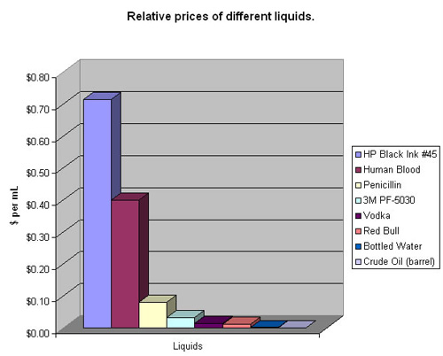

title=Printer
uuid=7eec03ce-e3a7-4032-aa07-b75dfb2f2d07
PROCESSOR=Markdown.pl
intro=We have one now
tags=Life
created=2017-09-18

Obligatory picture:

Picture saved from [Wayback Machine][wb],
originally posted at [gizmodo][g].

[wb]: http://web.archive.org/web/20130413215954/http://cache.gizmodo.com/assets/resources/2006/11/BloodInk.jpg
[g]: https://gizmodo.com/212444/hp-ink-costs-more-than-human-blood-booze

Disclaimer: I am not the author of the image, neither did I check its validity (it's from 2013, after all! Surely things should've changed since then!).
Moreover, our printer is not HP, but of another brand.
