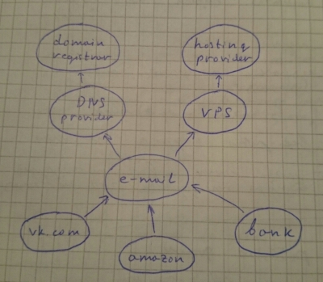

title=Security dream
PROCESSOR=Markdown.pl
intro=I had a dream. A nightmare, actually.
tags=security life
created=2015-01-28
modified=2016-12-14
modified_now=1

I dreamed that I lost my phone.
How bad could it be?
I had all important information properly [backed up][backupPhone],
but the phone was picked up by a hacker.

* The phone was protected by "pattern"
(to unlock the phone you connect few dots in a 3-by-3 grid).
Of course, it was quite easy to pick,
just by looking at the dirty screen.

* The phone had saved password to my email,
so of course hacker got access to it, too.

* I usually don't save passwords as emails,
but many services let you reset your password
by sending you an email with a link.
So did my [VPS][] provider.

* In the VPS control panel, hacker was able to change [root][] password for the VPS container.
Ouch.

* VPS had a keyfile to access my home machine.
Luckily, it gave hacker only user-level access.

* Unluckily, some of scripts in my home directory were referenced from `/etc/cron.daily/` and ran by root every day.
So the next day, hacker had [root][] access to my home machine, too.

* And I use this machine for online banking...

Question to the reader:
How many security rules did I break?
Can you enumerate all of them?
A winner will be mentioned on this blog!

> _Disclaimer:_
> 
> This was neither a dream, nor happened in reality.
> Actually it could not ever happen because many of the issues mentioned here didn't exist at the time of writing.
> Moreover, it will never happen because some of mentioned issues were fixed before I published this.
> 
> Please don't steal my phone!

I write this mainly to encourage those readers who has many accounts,
to decide which are "strongly protected" (like computer at your home),
and which are not (like phones and throw-away accounts on forums),
and to check how do they depend on each other.

If somebody breaks into your house and steals your laptop -
their access to your facebook account will be, probably, less of your worries.
But if to compromise your bank account it's enough just to steal your phone - then probably something's wrong.

I suggest drawing a diagram with all accounts you have,
and pointing arrows showing what depends on what.
For example, like this:

It shows that to get access to my vk.com account,
one needs to get access to my e-mail account first,
which he or she can get either by changing DNS records,
or accessing VPS where the mail is hosted.
Yes, this diagram misses the phone.

[backupPhone]: https://www.aeyoun.com/posts/abysmal-android-backups.html?pk_campaign=shpak
[VPS]: https://en.wikipedia.org/wiki/Virtual_private_server
[root]: https://en.wikipedia.org/wiki/Superuser
[sshR]: http://en.wikipedia.org/wiki/Reverse_connection
[VNC]: https://en.wikipedia.org/wiki/Virtual_Network_Computing
