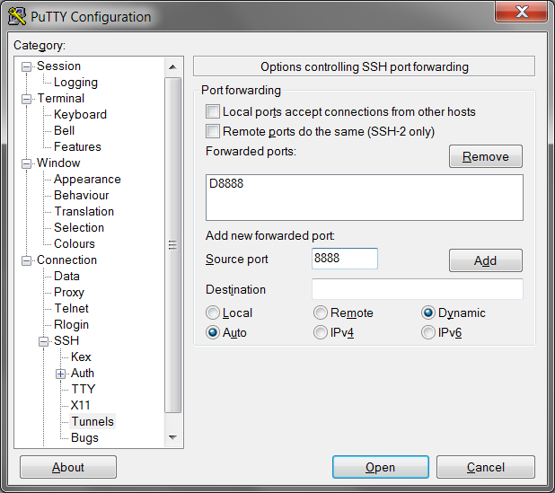

title=Dynamic port forwarding в PuTTY
intro=Как запустить SOCKS5 прокси с помощью PuTTY
tags=ссылки linux
created=2014-05-13
modified=2015-11-03
modified_now=1

На свою память пологаться, конечно, можно, но лучше иметь инструкцию с картинками, чтобы, если что-то не заработает, не пришлось бы задумываться: "это я что-то забыл или здесь что-то не работает"?

Такой гайд в картинках нашелся на сайте [erdees.ru](http://erdees.ru/it/socks5-proksi-cherez-ssh-tunnel-pri-pomoshhi-putty/), а ниже приведу его краткий конспект:

* на первой странице ввести Host Name и Port
* Connection -> SSH -> Tunnels:
  * Source port: (номер порта для прокси)
  * Destination: Dynamic, Auto
  * Add
* в браузере:
  * прописываем адрес прокси в поле "SOCKS"
  * все остальные поля оставляем пустыми
  * тип прокси: SOCKS 5
