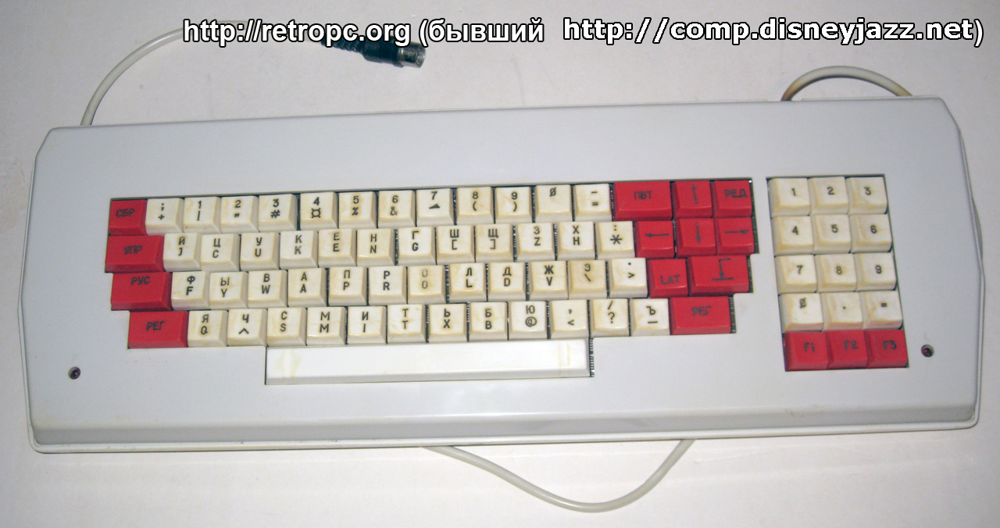

title=удобное переключение языков
intro=Shift - русский, Ctrl - норвежский, Windows - английский
tags=autohotkey
style=
styles=img blockquote pre
scripts=
created=2025-03-31
PROCESSOR=cmark-gfm --unsafe -e footnotes -e table -e strikethrough -e tasklist --strikethrough-double-tilde
uuid=3fdfb558-8b0b-4d7b-b7d9-aa7e553fcf3c

Вступление
----------

На клавиатурах советского компьютера АГАТ-9 для переключения раскладки клавиатуры были отдельные кнопки "РУС" и "LAT".


Клавиатура Компьютера Агат 9. Изображение с сайта [retropc.org][agat-url].

[agat-url]: https://retropc.org/Klaviatura_ot_Komp_yutera_Agat_9_k_1687.html

На современных компьютерах, к сожалению, таких кнопок больше нет, поэтому переключать языки приходится по-другому.
Хотя с другой стороны, вряд ли удалось бы найти клавиатуру с тремя кнопками для русского, норвежского, и английского языков.
Так что, может быть, это и к лучшему?

Реализация
----------

1. Настроить Windows так, чтобы у каждого языка было бы своё сочетание клавиш. В Windows 11 это делается так:

    1. открыть настройки (Settings)
    2. перейти в раздел "Time and language" (в колонке слева)
    3. Затем "Typing" - "Advanced keyboard settings" (большие кнопки)
    4. Нажать маленькую ссылку "Input language hot keys" - откроется нужное окно настроек.
    5. Там для каждого языка установить сочетание клавиш Ctrl+Shift+цифра:

        1. выбрать русский язык
        2. нажать "Change Key Sequence..."
        3. поставить галочку "Enable Key Sequence"
        4. в левом меню выбрать "Ctrl+Shift"
        5. в правом меню выбрать цифру "1"
        6. OK
	7. Повторить то же самое для норвежского языка, выбрать ему цифру "2"
	7. Повторить то же самое для английского языка, выбрать ему цифру "3"
    6. В итоге должно получиться [так](langahk-1.png).
    7. OK

    И на этом как будто бы всё: теперь можно переключать языки сочетаниями клавиш Ctrl+Shift+цифра.
    Но чтобы использовать для этого отдельные клавиши (Ctrl, Shift, Windows), надо сделать чуть больше:

1. Установить программу [AutoHotkey][ahk].

    * Если не удаётся установить с помощью установщика:

       1. скачать ZIP-архив (большая кнопка Download - маленькая ссылка Other versions - Download ZIP)
          и распаковать из него два файла: AutoHotkey64.exe и WindowSpy.ahk.
          AutoHotkey64.exe надо сразу переместить в папку, где он будет находиться - если сделать это после следющего шага, всё потом сломается.
       2. два раза щелкнуть по файлу WindowSpy.ahk - откроется окно выбора программы для его открытия.
         Оно должно выглядеть примерно [вот так](langahk-openwith.png).
       3. В нём надо выбрать "Choose an app on your PC" и указать программу AutoHotkey64.exe распакованную ранее.
       4. В окне выбора программы нажать кнопку "Always".
       4. Откроется [вот такое](langahk-err-ok.png) окно с ошибкой:

           > Error: #Include file "UX\WindowSpy.ahk" cannot be opened".

           Это хорошо - значит, AutoHotkey64 открыл этот файл.
       5. Окно с ошибкой можно закрыть

[ahk]: https://www.autohotkey.com/

3. Создать файл скрипта для AutoHotkey.

    * Если AutoHotkey устанавливалась с помощью установщика:

        1. открыть подходящую папку на компьютере (например, папку "Users" на диске C:, в ней - папку с именем своего пользователя)
        2. Щелкнуть правой кнопкой мыши по пустому месту
        3. В Windows 11 - выбрать последний пункт "Show more options"
        4. В появившемся меню выбрать "New" ("Создать") - "AutoHotkey Script"
        5. Назвать новый файл, например, "lang.ahk"
        6. Если будут спрашивать - выбрать "Empty"/"Clean slate", нажать "Create"

    * Если AutoHotkey устанавливалась распаковкой из ZIP-архива:

       1. переместить файл WindowSpy.ahk в подходящую папку на компьютере (например, папку "Users" на диске C:, в ней - папку с именем своего пользователя)
       2. переименовать его, например, в "lang.ahk"

3. Записать скрипт а файл.

    1. Щелкнуть правой кнопкой мыши по этому файлу
    2. Если в появившемся меню есть пункт "Edit in Notepad" - выбрать его.
       Если такого пункта нет:
       1. выбрать пункт "Open with" - "Choose another app"
       2. откроется окно выбора программы для его открытия.
         Оно должно выглядеть примерно [вот так](langahk-openwith.png).
       3. В нём надо выбрать Notepad и нажать "Just once".
    9. Если в файле что-то есть - удалить это.
    10. Вставить следующий текст:

		````
		LShift & F1::return
		LShift up::Send ^+1

		LControl & F1::return
		LControl up::Send ^+2

		LWin & F1::return
		LWin up::Send ^+3

		!x::SendInput {U+0301}
		````

    11. По необходимости его поправить:
        1. В строчке `LShift up::Send ^+1`, заменить цифру "1" на цифру того языка, который мы хотим чтобы включался по клавише Shift. Цифры языкам мы присвоили в предыдущем пункте.
        2. То же саме для строчек `LControl up::Send ^+2` (клавиша Ctrl) и `LWin up::Send ^+3` (клавиша Windows).
        3. Последняя строчка показывает, как сделать чтобы сочетание клавиш Alt+X добавляло символ с Unicode-кодом U+0301 - [символ ударения][x].
          По аналогии можно добавить любые другие символы, надо только узнать их Unicode-код.
	  Например, на [этой странице википедии][mibs] можно узнать, что у эмотикона 🕴️ 
	  "Man in Business Suit Levitating" Unicode-код U+1F574.
	  Поэтому, чтобы чтобы вводить его по сочетанию клавиш Alt+I,
	  надо добавить в этот файл такую строчку:

           ````
           !i::SendInput {U+1F574}
           ````

	4. Строчки которые заканчиваются на `... & F1::return` нужны, чтобы соответствующая кнопка
	  продолжала выполнять свою обычную функцию (Shift - делать буквы большими, Ctrl - копировать/вставить, и т.д)

    Теперь, чтобы переключение заработало, достаточно запустить этот скрипт
    (щелкнуть по нему два раза).
    Но чобы не приходилось делать это после каждой перезагрузки, надо:

[x]: https://www.fileformat.info/info/unicode/char/0301/index.htm
[mibs]: https://en.wikipedia.org/wiki/Man_in_Business_Suit_Levitating_emoji#As_an_emoji

5. Добавить скрипт в автозагрузку.
    1. Щелкнуть по скрипту правой кнопкой мыши
    3. В Windows 11 - выбрать последний пункт "Show more options"
    4. В появившемся меню выбрать "Create shortcut" (внизу, рядом с "Delete") - появится новый файл "lang - Shortcut"
    5. Щелкнуть по этому новому файлу правой кнопкой мыши, выбрать "Cut" (Вырезать)

    1. Открыть "Мой компьютер", диск С:, папку "Users"
    2. В этой папке открыть папку с именем текущего пользователя
    3. Тут открыть папку "AppData". Если её не видно, включить показ "спрятанных" папок.
       В Windows 11 для этого надо в верхнем меню выбрать "View", там "Show" - "Hidden items"
       ([см. рис](langahk-2.png))
    4. В папке "AppData" открыть "Roaming", там "Microsoft", дальше "Windows", "Start Menu", "Programs", "Startup".
       Пошутить про Кощея
    2. Щелкнуть правой кнопкой мыши по пустому месту, выбрать "Paste" (Вставить)

    Можно на всякий случай перезагрузить комп, чтобы проверить, что действительно работает после перезагрузки.
