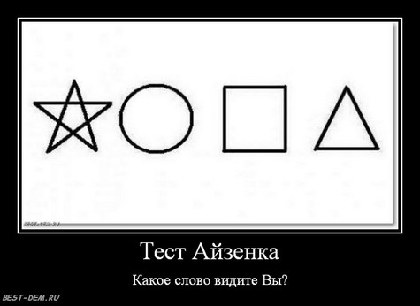

title=omerta
intro=Как иностранцы коверкают русские слова
tags=юмор
created=2014-10-23
modified=2014-11-03
modified_now=1

Что будет, если человек, не знающий кириллицу, увидит русское слово?
Скорее всего, глупость - как пятилетний ребенок, впервые увидевший английские буквы.
Ну или как если бы наш человек, не знающий китайского, попытался бы его прочитать: "лодочка, домик, фигня какая-то, еще какая-то штука".
Но иногда получается смешно.

Вот недавно один мой коллега, увидев слово "Отправить", прочитал его "Omerta".
Как ему так удалось - непонятно.
Но смешно.

У кого-нибудь есть какие-нибудь подобные истории?
Присылайте их мне на e-mail (он указан внизу страницы).

* * *

Анонимный комментарий:
> Этот тест будет понятен только русским)
> 
> 

> 	<a href="http://best-dem.ru/test-ajzenka-kakoe-slovo-vidite-vy.html">
> 		
> 	</a>
> 

Мой ответ:

> Фразы, которые нельзя прочитать правильно с первого раза:  
> 1. Я тебе отослала.  
> 2. Крутые выбоены.  
> 3. Где снять двушку?  
> 4. Хочу лишиться действительности...
