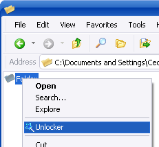

title=Unlocker
intro=Разблоктровать доступ к файлам
tags=программы
created=2009-10-24

<b>Проблема:</b>

<ul>
<li>Файл не удаляется, выскакивает окошко с непонятной ошибкой.</li>
<li>Флешка не хочет «безопасно» удаляться</li>
</ul>

<b>Решение:</b>&nbsp;Установить&nbsp;<a href="http://www.emptyloop.com/unlocker/">Unlocker</a>

<b>Результат:</b>&nbsp;Теперь, если щелкнуть правой кнопкой мышки по файлу и выбрать «Unlocker», можно увидеть, какие программы заблокировали этот файл, разблокировать и удалить (переименовать, копировать) его. То же самое можно сделать и с флешкой.

<b>Скриншот:</b>

