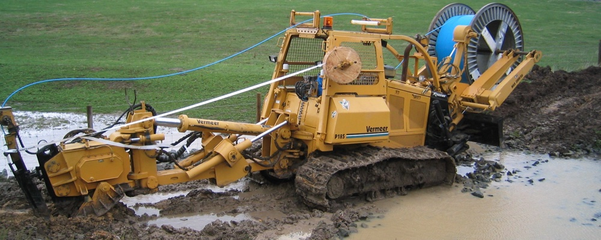

title=Кабелеукладчик
uuid=3cc21294-30b4-4f7f-afda-0a7af077ac1c
intro=Рассказ о пользе собак модели "Такса"
tags=Юмор
style=
styles=img archive
created=2009-06-23
PROCESSOR=cmark-gfm --unsafe -e footnotes -e table -e strikethrough -e tasklist --strikethrough-double-tilde

Что представляет из себя настоящий "кабелеукладчик". Изображение с сайта [perevozkaz24.ru][p].

[p]: https://perevozka24.ru/pages/kabeleukladchik-chto-on-soboy-predstavlyaet

Однажды мне было необходимо срочно проложить четыре десятка проводов витой пары на расстояние в сто метров. Большая часть дистанции проходила над навесным потолком на трёхметровой высоте. Поняв, что для моих единственных в конторе админских плеч решение задачи в приемлемые сроки является непосильным, я принялся терзать шефа на предмет привлечения сторонних монтажников, и тот, скрепя сердце, согласился. Я разработал техзадание, разослал по разным конторам и стал ждать.

Одно из предложений сильно выделялось из общей массы. Ребята утверждали, что работу они выполнят всего за один день, причём втрое дешевле, чем любой из конкурентов! На всякий случай перезвонил и уточнил, правильно ли они поняли задание. Ответили, что поняли прекрасно, а скорость и дешевизна объясняется тем, что в работе используется кабелеукладчик. Я был заинтригован — с кабелеукладчиками имел дело в армии и решительно не представлял, каким образом данный девайс можно приспособить к прокладке витой пары под фальшпотолком.

В назначенный день прибыли всего два монтажника со стремянками и инструментами. Наблюдая за процессом разгрузки, я с нетерпением ждал чудо-агрегата, способного автоматизировать процесс. Агрегата так не дождался, зато последней из микроавтобуса была выгружена некрупная такса. Не успел я удивиться по поводу появления животного, как мне объяснили, что это и есть таинственный кабелеукладчик.

В комплекте к таксе шел специальный костюмчик с ручкой вдоль спины для переноски, сбруя на голову со светодиодным фонариком и шлейка. Прокладка кабеля осуществлялась путём прикрепления его к шлейке и запуска таксы в труднодоступное место. Надрессированное животное шустро мчалось на звук голоса или свет фонаря, волоча за собой провод. Потолок собаку выдерживал, мощности же хватало метров на пятьдесят.

Скорость прокладки в длинных и труднодоступных участках была просто фантастической. Такса резво носилась в одну сторону по верху, а обратно — по коридору, пугая женскую часть персонала. Даже ЧП в виде выпавшей панельки потолка не повлияло на её настроение: протягиваемый провод сыграл роль страховочного троса, и собачка плавно опустилась на пол. Ребята сказали, что к таким ситуациям кабелеукладчик приучен.

Смех смехом, но такса на полном серьёзе стояла у ребят на балансе фирмы — мне были продемонстрированы документы. Работу дружный коллектив действительно выполнил менее, чем за день, причем без предварительного разматывания кабеля и, соответственно, без обрезков. Правда, работа нашей конторы полностью встала — всё население сбежалось посмотреть за работой кабелеукладчика.

Источник: [ithappens](http://ithappens.ru/story/1003)[(архивния копия)](https://archive.ph/4V8yl)
