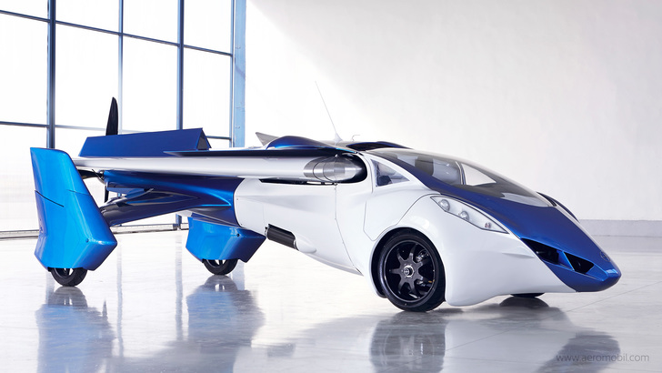

title=Летающий автомобиль
intro=Что я думаю о подобных гибридах
tags=ссылки
created=2014-10-29
modified=2016-09-06
modified_now=1

Картинка с сайта [aeromobil.com](http://aeromobil.com/)

* * *

Прочитал [на медузе][meduza.io] новость про "летающий автомобиль".
Посмотрел [ролик на ютьюбе][yt].
Вспомнил про [автомобили-амфибии][amf].

Подумалось: такие гибриды подходят только тем, кому действительно надо быть в двух местах одновременно.
Потому что на дороге гибрид самолета и автомобиля выглядит так же неуместно, как самолет, а в воздухе - так же неуклюже, как автомобиль.
Аналогично автомобиль-амфибия - на пляже он смотрится адекватно, а в глубине города - удивительно.

Как люди ни стараются, эти вещи все равно слишком разные, чтобы их гибрид выглядел нормально.

[meduza.io]: https://meduza.io/news/2014/10/29/v-vene-pokazali-letayuschiy-avtomobil
[yt]: https://www.youtube.com/watch?v=kzYb68qXpD0
[amf]: https://www.google.ru/search?q=амфибия&tbm=isch
